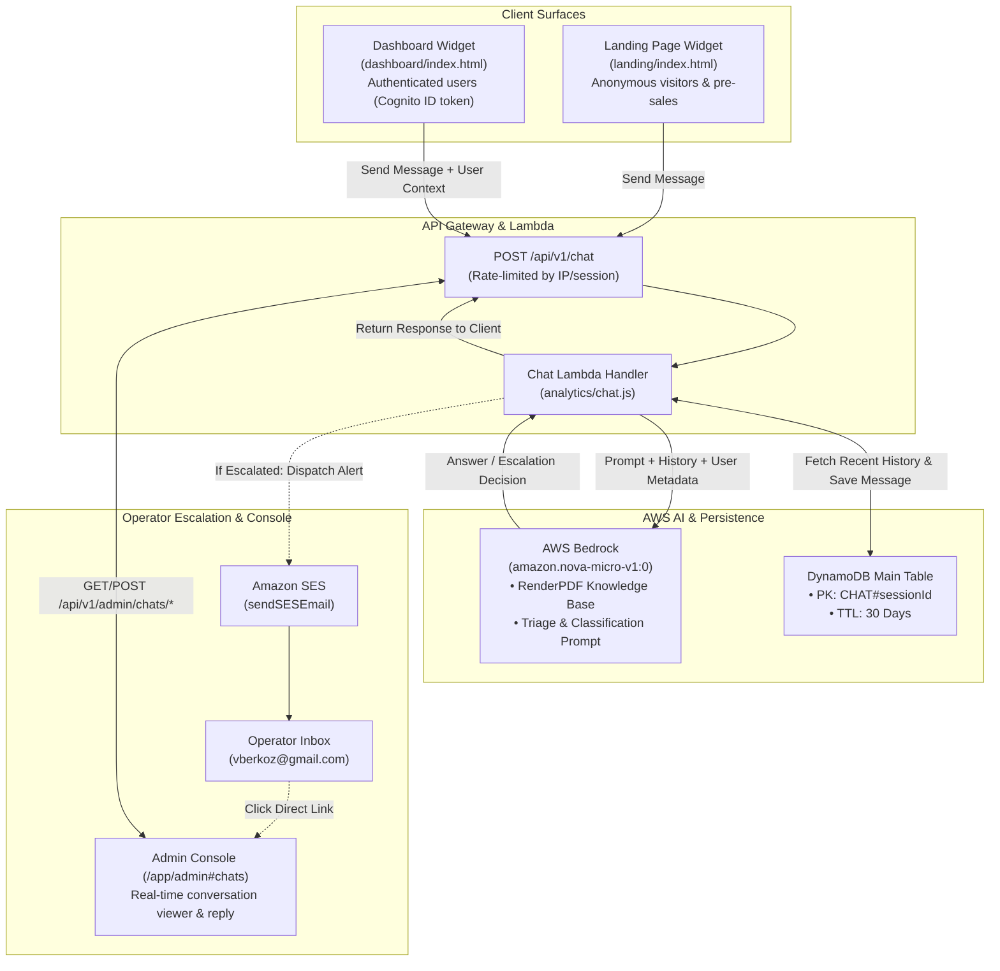

# Feature Spec: AI Support Chatbot & Admin Inbox (`/admin/chats`)

| Field | Value |
| :--- | :--- |
| **Feature ID** | FEAT-ADMIN-SUPPORT-CHAT |
| **Route** | `/admin/chats` (Admin Console) & `/api/v1/chat` (Public API) |
| **Feature Path** | `dashboard/admin/features/support-chat/` |
| **Status** | Approved / Ready for Implementation |
| **Target Surface** | Public Live Chat Widget (`landing/` & `dashboard/`), Support API, AWS Bedrock, SES Alerts, Admin Inbox UI |
| **Parent Spec** | [Master Spec: SPEC-ADMIN-MASTER](file:///Users/basilsergius/projects/renderpdf/dashboard/admin/spec.md) |

---

## 1. Overview & Objective

RenderPDF replaces third-party live chat widgets (such as Crisp or Chatwoot) with a **first-party, serverless AI support chatbot and operator inbox** powered by **AWS Bedrock** and **Amazon SES**.

### Core Value Drivers:
1. **High-Value Lead Conversion**: Real-time sales and technical assistance for prospective customers exploring [`landing/index.html`](file:///Users/basilsergius/projects/renderpdf/landing/index.html) and documentation.
2. **Context-Aware Customer Support**: In [`dashboard/index.html`](file:///Users/basilsergius/projects/renderpdf/dashboard/index.html), the widget automatically enriches conversations with the customer's Cognito identity (`email`, `sub`), active subscription tier (`free`, `starter`, `pro`), and quota saturation.
3. **Zero Recurring SaaS Subscriptions**: Eliminates recurring \$25–\$95/month fees for third-party chat software.
4. **Fraction-of-a-Cent Inference**: Powered by **Amazon Nova Micro** (`amazon.nova-micro-v1:0`), costing $\approx \$0.000035$ per 1,000 input tokens (handling 5,000 full conversations for under \$0.50/month).
5. **Intelligent Autonomous vs. Human Triage**:
   - Autonomously answers documentation, code snippet, paper format, and pricing questions using an embedded RenderPDF knowledge base.
   - Automatically detects enterprise inquiries (>50k renders/mo, custom SLAs), complex rendering bugs, billing issues, or explicit requests for human support.
6. **Instant Operator Email Alerting**: Fires instantaneous alerts via Amazon SES ([`analytics/notifications.js`](file:///Users/basilsergius/projects/renderpdf/analytics/notifications.js)) to `OperationsAlertEmail` (`vberkoz@gmail.com`) when a conversation is escalated.
7. **Unified Admin Live Chat Inbox**: Dedicated tab in `/app/admin` allowing operators to review all conversations, view visitor dossiers, and respond directly.

---

## 2. System Architecture & Pipeline Flow



---

## 3. Data Model: DynamoDB Chat Sessions & Messages

Chat sessions and messages are stored in DynamoDB (`TABLE_NAME`) with a **30-day native TTL** (`expiresAt`) to prevent database bloat while maintaining an audit trail for operator follow-ups.

### 3.1 Chat Session Metadata (`SK = 0`)
- **Partition Key**: `requestId = "CHAT#<sessionId>"`
- **Sort Key**: `timestamp = 0`
- **Entity Type**: `entityType = "CHAT_SESSION"`
- **GSI1PK**: `CHAT_STATUS#<status>` (`active`, `escalated`, `resolved`)
- **GSI1SK**: `<lastActivityTimestamp>` (ISO-8601 string for reverse-chronological sorting)

```json
{
  "requestId": "CHAT#cs_7f8a9b1c2d3e",
  "timestamp": 0,
  "entityType": "CHAT_SESSION",
  "sessionId": "cs_7f8a9b1c2d3e",
  "status": "escalated",
  "escalationReason": "high_value_lead",
  "source": "landing",
  "visitorEmail": "cto@fintechscale.com",
  "customerId": null,
  "plan": "anonymous",
  "unreadByAdmin": true,
  "summary": "Inquiring about 150k renders/mo volume pricing and custom SLA terms.",
  "createdAt": "2026-09-28T14:30:00Z",
  "updatedAt": "2026-09-28T14:32:15Z",
  "escalatedAt": "2026-09-28T14:32:15Z",
  "expiresAt": 1730125935,
  "messageCount": 4
}
```

### 3.2 Chat Message Record (`SK = <epoch_ms>`)
- **Partition Key**: `requestId = "CHAT#<sessionId>"`
- **Sort Key**: `timestamp = <epoch_ms>`
- **Entity Type**: `entityType = "CHAT_MESSAGE"`

```json
{
  "requestId": "CHAT#cs_7f8a9b1c2d3e",
  "timestamp": 1727533935120,
  "entityType": "CHAT_MESSAGE",
  "messageId": "msg_01",
  "role": "assistant",
  "sender": "bot",
  "content": "RenderPDF easily supports high volumes. For scale exceeding 50,000 PDFs/month, our engineering team sets up custom dedicated concurrency and volume pricing. I have flagged your request directly to our lead operator—what is the best email address to send custom enterprise terms to?",
  "escalated": true,
  "tokens": { "input": 612, "output": 78 }
}
```

---

## 4. API Contracts

### 4.1 Public Visitor Chat Endpoint
`POST /api/v1/chat`

Unauthenticated, rate-limited by client IP (15 requests/min, 60 requests/hour).

**Request Body**:
```json
{
  "sessionId": "cs_7f8a9b1c2d3e",
  "message": "Can I password protect PDFs and restrict printing permissions?",
  "visitorContext": {
    "url": "https://renderpdf.vberkoz.com/#pricing",
    "email": "lead@enterprise.com",
    "userId": "c1f7b76e-3c2e-4b21-8273-df3e18a992bc",
    "plan": "starter"
  }
}
```

**Response `200 OK`**:
```json
{
  "sessionId": "cs_7f8a9b1c2d3e",
  "reply": "Yes! RenderPDF supports AES-256 PDF encryption. You can set `options.password` for the open password, `options.ownerPassword` for administrative access, and `options.permissions` to 'print', 'all', or 'none' to restrict printing and copying.",
  "escalated": false,
  "requiresEmail": false
}
```

### 4.2 List Chat Conversations (Admin)
`GET /api/v1/admin/chats?status={all|escalated|active|resolved}&limit={limit}&cursor={cursor}`

Requires Cognito Admin token. Returns a paginated list of chat sessions sorted by reverse-chronological activity.

**Response `200 OK`**:
```json
{
  "chats": [
    {
      "sessionId": "cs_7f8a9b1c2d3e",
      "status": "escalated",
      "escalationReason": "high_value_lead",
      "visitorEmail": "lead@enterprise.com",
      "customerId": "c1f7b76e-3c2e-4b21-8273-df3e18a992bc",
      "plan": "starter",
      "source": "landing",
      "lastMessage": "We need around 200,000 PDFs per month with a custom BAA. Can we negotiate terms?",
      "unreadByAdmin": true,
      "messageCount": 5,
      "updatedAt": "2026-09-28T14:32:15Z"
    }
  ],
  "nextCursor": null
}
```

### 4.3 Get Chat Transcript (Admin)
`GET /api/v1/admin/chats/{sessionId}`

**Response `200 OK`**:
```json
{
  "sessionId": "cs_7f8a9b1c2d3e",
  "status": "escalated",
  "escalationReason": "high_value_lead",
  "visitorEmail": "lead@enterprise.com",
  "customerId": "c1f7b76e-3c2e-4b21-8273-df3e18a992bc",
  "plan": "starter",
  "source": "landing",
  "unreadByAdmin": false,
  "messages": [
    {
      "messageId": "msg_01",
      "role": "user",
      "sender": "visitor",
      "content": "Hi, what are your volume discounts for 200k documents a month?",
      "timestamp": 1727533800000
    },
    {
      "messageId": "msg_02",
      "role": "assistant",
      "sender": "bot",
      "content": "RenderPDF easily supports high volumes. For scale exceeding 50k PDFs/month, our engineering team provisions dedicated capacity with tailored volume pricing. I have notified our lead operator to follow up with you. Could you share your company name?",
      "timestamp": 1727533801200
    }
  ]
}
```

### 4.4 Post Operator Reply (Admin)
`POST /api/v1/admin/chats/{sessionId}/reply`

Appends an operator response to the chat and optionally dispatches an email copy to the customer via Amazon SES.

**Request Body**:
```json
{
  "message": "Hi! This is Basil from RenderPDF. We'd be glad to support 200k docs/mo. I've sent custom pricing details to your email.",
  "sendEmail": true
}
```

**Response `200 OK`**:
```json
{
  "success": true,
  "messageId": "msg_03",
  "emailDispatched": true
}
```

### 4.5 Update Chat Status (Admin)
`POST /api/v1/admin/chats/{sessionId}/status`

**Request Body**:
```json
{
  "status": "resolved"
}
```

---

## 5. Bedrock Prompt & Knowledge Base Specification

### 5.1 System Prompt & Decision Logic
The assistant is prompted with strict triage instructions:

```text
You are RenderPDF's developer support AI. Your role is to answer questions accurately using the provided RenderPDF Knowledge Base.

Follow this decision protocol for every turn:
1. AUTONOMOUS RESOLUTION:
   - Answer technical, syntax, paper sizing, header/footer, auth, and pricing tier questions directly with concrete JSON / code examples.
   - Include output tag: [DECISION: ANSWER]

2. HUMAN ESCALATION:
   - If the user asks for high-volume enterprise pricing (>50k renders/month), custom SLA/contracts, reports a reproducible system crash/bug, has a billing dispute, or explicitly asks for a human, respond politely and explain you are notifying the engineering team.
   - If user email is unknown, ask: "What is the best email address for our lead operator to reach you at?"
   - Include output tag: [DECISION: ESCALATE]
   - Include reason tag: [ESCALATION_REASON: high_value_lead | complex_bug | billing_issue | explicit_request]
```

### 5.2 Embedded Knowledge Base Modules
1. **API Endpoints**: Canonical `/api/v1/render`, trial `/api/v1/trial/render`, templates `/api/v1/templates`, packages `/api/v1/files/upload`, batches `/api/v1/batches`.
2. **Options**: `format` (`A4`, `Letter`, `Legal`), `margin` (`0–50mm` / `0–2in`), `headerTemplate`, `footerTemplate`, `displayHeaderFooter`, `printBackground`.
3. **Security**: `password`, `ownerPassword`, `permissions` (`print`, `all`, `none`).
4. **Quotas & Pricing**:
   - Free anonymous trial: 3 renders/day per IP (1MB HTML max).
   - Free account: 25 renders/month.
   - Starter: \$19/month (\$190/year) for 5,000 renders.
   - Pro: \$49/month (\$490/year) for 20,000 renders.
   - Overage: \$10 for 1,000 credits.
5. **Webhooks & Async**: HMAC signatures (`X-RenderPDF-Signature`), SQS outbox delivery.

### 5.3 Operator Email Alert Template (Amazon SES)
Dispatched immediately when `[DECISION: ESCALATE]` is triggered:
- **To**: `OperationsAlertEmail` (`vberkoz@gmail.com`)
- **Subject**: `[RenderPDF Chat Escalation] <Visitor Email or Anonymous IP> - <Reason>`
- **Body**:
  - Customer status: Plan, quota usage, account ID.
  - Escalation category and summary.
  - Recent chat transcript.
  - Direct deep link to `/app/admin#chats?id=<sessionId>`.

---

## 6. Frontend UI Specifications

### 6.1 Public Client Chat Widget (`chat-widget.js`)
- **Footprint**: Lightweight vanilla JS & CSS (~6 KB gzipped, zero external dependencies).
- **Placement**: Embedded in [`landing/index.html`](file:///Users/basilsergius/projects/renderpdf/landing/index.html) and [`dashboard/index.html`](file:///Users/basilsergius/projects/renderpdf/dashboard/index.html).
- **Session State**: Persisted in `sessionStorage` (`renderpdf_chat_session_id`).
- **Dashboard Context Pass-Through**: Reads user email and plan from Cognito token in `dashboard/app.js` and automatically sends `visitorContext`.

### 6.2 Admin Live Chat & Support Inbox (`/app/admin#chats`)
Integrated into the Admin Console as **Tab 5**:
- **Left Pane (Conversation Queue)**:
  - Search input filtering by email or message text.
  - Filter chips: `All`, `Escalated` (red badge with count), `Active`, `Resolved`.
  - Chat card items displaying: visitor email, time elapsed, message preview, unread indicator dot, and escalation reason tag.
- **Right Pane (Conversation Workspace)**:
  - **Header**: Visitor title, plan badge (`Starter`, `Pro`, `Anonymous`), status toggle (`Active`, `Resolved`), and button: `Inspect in User Directory` (deep-linking to customer dossier).
  - **Message Stream**:
    - Visitor messages: Slate bubble on the left.
    - AI Assistant: Neutral bubble with "AI Assistant" pill and token metric.
    - Operator Reply: Emerald green bubble on the right with "Operator" badge.
  - **Operator Reply Bar**:
    - Multi-line textarea.
    - Canned snippet dropdown (quick links to docs, pricing, enterprise calendly).
    - `Send Reply` button + `[x] Send copy to visitor's email via SES` checkbox.
    - `Resolve Conversation` button.

---

## 7. Implementation Tasks

| Task ID | Task Title | Target Files | Status |
| :--- | :--- | :--- | :--- |
| [**TASK-CHAT-01**](file:///Users/basilsergius/projects/renderpdf/dashboard/admin/features/support-chat/tasks/01-bedrock-knowledge-and-chat-api.md) | Bedrock Nova Micro & Public Chat API | `infra/cloudformation.yaml`, `analytics/chat.js` | Completed |
| [**TASK-CHAT-02**](file:///Users/basilsergius/projects/renderpdf/dashboard/admin/features/support-chat/tasks/02-escalation-and-ses-alerts.md) | Triage Engine, SES Alerts & Admin API | `analytics/chat.js`, `analytics/notifications.js` | Completed |
| [**TASK-CHAT-03**](file:///Users/basilsergius/projects/renderpdf/dashboard/admin/features/support-chat/tasks/03-client-chat-widget.md) | Client Chat Widget Script | `landing/index.html`, `dashboard/index.html`, `dashboard/chat-widget.js` | Completed |
| [**TASK-CHAT-04**](file:///Users/basilsergius/projects/renderpdf/dashboard/admin/features/support-chat/tasks/04-admin-chat-inbox-ui.md) | Admin Live Chat & Support Inbox UI | `dashboard/admin/index.html`, `dashboard/admin/admin.js`, `dashboard/admin/admin.css` | Completed |

---

## 8. Verification & Acceptance Criteria

| ID | Test Scenario | Expected Outcome |
| :--- | :--- | :--- |
| **TC-CHAT-01** | Visitor asks pre-sales/syntax question on landing page | Nova Micro answers autonomously with accurate code snippet in $< 800\text{ms}$. |
| **TC-CHAT-02** | Visitor asks for enterprise contract (>50k renders) or requests human | Model outputs `[DECISION: ESCALATE]`, asks for email if unknown, and marks session `status: escalated`. |
| **TC-CHAT-03** | Escalation occurs in production | SES sends alert email to `OperationsAlertEmail` with transcript and deep-link within 2 seconds. |
| **TC-CHAT-04** | Operator opens Live Chat tab in `/app/admin` | Escalated conversation appears at top of queue with unread badge; clicking loads transcript and user dossier button. |
| **TC-CHAT-05** | Operator posts reply in `/app/admin` | Reply persisted in DynamoDB; visitor widget receives message on next poll; email copy sent to visitor if email was provided. |
| **TC-CHAT-06** | Chat session inactive for 30 days | Automatically pruned by DynamoDB TTL without manual maintenance. |
