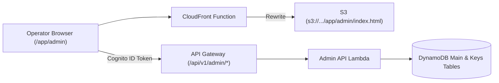

# Master Spec: RenderPDF Admin Console (`/app/admin`)

| Field | Value |
| :--- | :--- |
| **Document ID** | SPEC-ADMIN-MASTER |
| **Status** | Approved / In Development |
| **Target Surface** | Static `/app/admin` web application (`dashboard/admin/`) & Admin API endpoints |
| **Target Audience** | RenderPDF Operators, Support Engineers, Full-Stack AI Agents |
| **Architecture Style** | Feature-Slice Architecture & Native Serverless / DynamoDB |
| **Related Docs** | [ARCHITECTURE.md](file:///Users/basilsergius/projects/renderpdf/docs/ARCHITECTURE.md), [service-map.md](file:///Users/basilsergius/projects/renderpdf/docs/service-map.md) |

---

## 1. System Vision & Architecture

The RenderPDF Admin Console (`/app/admin`) is an internal, secure operational console and business intelligence dashboard. It runs as a pure static single-page app within the existing `dashboard/` suite, communicating with serverless backend APIs (`/api/v1/admin/*`) deployed on AWS Lambda, API Gateway, DynamoDB, and Cognito.

### Core Architectural Decisions
1. **Zero External SaaS Dependencies**: All growth funnels, onboarding velocity metrics, render latency histograms, and unit economics are computed natively using a DynamoDB pre-aggregated daily rollup engine. No third-party analytics trackers (PostHog, Segment, Mixpanel) are required.
2. **Feature-Slice Architecture**: All admin code and specifications are split into self-contained feature slices under `dashboard/admin/features/`, sharing common primitives in `dashboard/admin/shared/`.
3. **Dual-Record Telemetry Model**: Raw request events (`USAGE#<id>`) use a 14–30 day TTL for point-in-time debugging, while permanent daily rollups (`ROLLUP#YYYY-MM-DD`) maintain sub-second $O(1)$ dashboard reads via `BatchGetItem`.
4. **Strict RBAC & Auditability**: Access is guarded by the Cognito `Admins` group (with `STATS_ALLOWED_EMAIL` fallback). Every administrative state mutation writes an immutable record to `ADMIN_AUDIT#YYYY-MM-DD`.

---

## 2. Global Infrastructure & Routing

### 2.1 Static Hosting & CDN Routing
- **Source Location**: `dashboard/admin/`
- **S3 Sync**: [`scripts/deploy.sh`](file:///Users/basilsergius/projects/renderpdf/scripts/deploy.sh#L247) syncs `dashboard/` to `s3://${WEBSITE_BUCKET}/app/` recursively.
- **CloudFront Routing**: In [`infra/cloudformation.yaml`](file:///Users/basilsergius/projects/renderpdf/infra/cloudformation.yaml#L335), the CloudFront Function rewrites `/app/admin` and `/app/admin/` to `/app/admin/index.html`.



### 2.2 Security & Authentication Flow
1. **Client Guard**: Reads `id_token` from `localStorage`. If expired or missing, sets `post_login_redirect = '/app/admin'` and redirects to `/app/login`. If the decoded token is not in group `Admins` and email does not match `STATS_ALLOWED_EMAIL`, renders a strict **403 Forbidden** view.
2. **Server Guard**: All `/api/v1/admin/*` routes require the Cognito User Pool Authorizer. The backend Lambda inspects `requestContext.authorizer.claims` and rejects non-admin callers.

---

## 3. Directory Structure

```text
dashboard/admin/
├── spec.md                              # This Master Specification & Index
├── index.html                           # App Shell (Navigation, Tab Container, Modals)
├── admin.js                             # Master Controller (Auth, Tab Router, State)
├── admin.css                            # Admin Layout & Dark Theme Tokens
│
├── shared/                              # Shared Primitives
│   ├── api.js                           # Standardized fetch client with Bearer auth
│   ├── auth.js                          # Cognito JWT decoder & RBAC checker
│   └── ui.js                            # Accessible modals, focus traps, toasts
│
└── features/                            # Encapsulated Feature Slices (Route-Based)
    ├── analytics/                       # Route: /admin/analytics (Rollup Engine & Unit Economics)
    │   ├── spec.md                      # Feature Specification
    │   └── analytics.js                 # UI Tab & Chart Renderer
    │
    ├── users/                           # Route: /admin/users (User Search & Support Dossier)
    │   ├── spec.md                      # Feature Specification
    │   └── users.js                     # Users Table & Sliding Drawer Renderer
    │
    ├── plans/                           # Route: /admin/plans (Plan Overrides & Quota Relief)
    │   ├── spec.md                      # Feature Specification
    │   └── plans.js                     # Plan & Quota Modal Handlers
    │
    └── audit-logs/                      # Route: /admin/audit-logs (Security & Audit Logging)
        ├── spec.md                      # Feature Specification
        └── governance.js                # Audit Log Table & Danger Zone Handlers
```

---

## 4. Feature Index & Specifications

Each feature is documented in its dedicated specification file with isolated API contracts, DynamoDB schemas, and acceptance criteria:

### [Feature: Analytics (`/admin/analytics`)](file:///Users/basilsergius/projects/renderpdf/dashboard/admin/features/analytics/spec.md)
* **Route / Folder**: `features/analytics/`
* **Purpose**: Native DynamoDB daily rollup engine (`ROLLUP#YYYY-MM-DD`). Replaces multi-thousand item scans with sub-second `BatchGetItem` reads. Computes growth funnels, Time to First Call (TTFC), latency histograms (P95), and real-time gross margins against AWS infrastructure costs.
* **Endpoints**: `GET /api/v1/admin/analytics?days={days}`

### [Feature: Users (`/admin/users`)](file:///Users/basilsergius/projects/renderpdf/dashboard/admin/features/users/spec.md)
* **Route / Folder**: `features/users/`
* **Purpose**: Fast customer lookup by email prefix or Cognito `sub`. Sliding inspection drawer assembling user identity, current plan, monthly quota progress, active API keys, and recent 25 render logs.
* **Endpoints**: `GET /api/v1/admin/users`, `GET /api/v1/admin/users/{userId}`

### [Feature: Plans (`/admin/plans`)](file:///Users/basilsergius/projects/renderpdf/dashboard/admin/features/plans/spec.md)
* **Route / Folder**: `features/plans/`
* **Purpose**: Manual plan tier overrides (`free`, `starter`, `pro`, `enterprise`) with automated API Gateway Usage Plan synchronization. Sets `manualOverride: true` to protect accounts from automated Paddle webhook downgrades. Grants emergency render credits.
* **Endpoints**: `POST /api/v1/admin/users/{userId}/plan`, `POST /api/v1/admin/users/{userId}/quota`

### [Feature: Audit Logs (`/admin/audit-logs`)](file:///Users/basilsergius/projects/renderpdf/dashboard/admin/features/audit-logs/spec.md)
* **Route / Folder**: `features/audit-logs/`
* **Purpose**: Account suspension/activation in Cognito + key deactivation, compromised API key revocation, and immutable logging of all administrative actions to `ADMIN_AUDIT#YYYY-MM-DD` with a 365-day TTL.
* **Endpoints**: `POST /api/v1/admin/users/{userId}/status`, `POST /api/v1/admin/users/{userId}/keys/{keyId}/revoke`, `GET /api/v1/admin/audit-logs`

---

## 5. Sequential Implementation Roadmap

| Step | Feature Route | Key Deliverables | Verification Milestone |
| :---: | :--- | :--- | :--- |
| **1** | **Shared Primitives** | `shared/auth.js`, `shared/api.js`, `shared/ui.js` | Unit tests for auth decoding and API client |
| **2** | **`analytics`** | `ROLLUP#YYYY-MM-DD` atomic updates + `GET /admin/analytics` | `BatchGetItem` reads 30 days in $<20\text{ms}$ |
| **3** | **`users`** | User search + Sliding drawer dossier | Search email returns user with active keys & logs |
| **4** | **`plans`** | Plan overrides + `syncUserUsagePlans` + Paddle guard | Free user upgraded to Pro, key moved to `ProUsagePlan` |
| **5** | **`audit-logs`** | User suspend + key revoke + `ADMIN_AUDIT` table | Action logged to audit table, user blocked |
